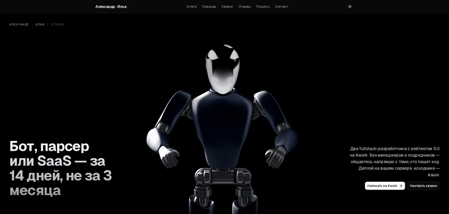

# site3d — студия Александра и Ильи



Лендинг двух-person dev-студии (fullstack + AI) на Next.js. Цель страницы — превращать визитёров в заказчиков на Kwork.

[**Открыть live →**](https://site3d-rrrg23886-7973s-projects.vercel.app/)

[Полный скриншот страницы](./public/preview.png) · [Hero-блок с курсором-фолоу робота](./public/hero.gif)

---

## Что на странице

| Секция | Что внутри |
|--------|------------|
| Hero | 3D-сцена (Spline) + benefit-led заголовок + CTA |
| Marquee | Бегущая лента услуг и стека |
| Услуги | 6 направлений с указанием исполнителя (lead / partner / оба) |
| Команда | Два профиля с рейтингом 5.0 на Kwork |
| Кворки | 9 готовых предложений с фиксированной ценой (editorial list) |
| Отзывы | Две большие цитаты в print-spread стиле |
| Процесс | Три шага — скоуп / сборка / сдача |
| Контакт | Финальный CTA в инвертированном dark-стиле |

## Стек

- **Next.js 16.2.6** (App Router, Turbopack)
- **React 19.2.4** + **TypeScript 5**
- **Tailwind CSS v4** + `tw-animate-css`
- **Motion 13** (formerly framer-motion) — точечно, для hover-микровзаимодействий
- **Spline** (Public Viewer iframe) — 3D-персонаж в hero
- **shadcn/ui** + **lucide-react**
- **Vercel** — hosting + production deploy

## Архитектурные решения

### 1. CSS Scroll-Driven Animations вместо motion/react scroll-hooks

Спека [scroll-driven-animations.style](https://scroll-driven-animations.style/) — `animation-timeline: scroll()` и `animation-timeline: view()`. Эффекты интерполируются браузерным движком анимаций **off the main thread**, что критично для слабых GPU (интегрированная графика, мобилки):

- **Reading progress bar** — `scroll(root)` → `scaleX(0..1)`. Заменил `useScroll + useSpring`.
- **Header shadow on scroll** — `scroll(root)` + `animation-range: 0 80px`. Тень появляется при скролле.
- **Hero parallax** — `scroll(root)` + `animation-range: 0 100vh`. Hero уезжает вверх на 15% при скролле первого экрана.
- **Section reveals** — `view()` + `animation-range: entry 5% cover 60%`. Каждый заголовок и каждая карточка фейдятся при попадании в viewport. Заменил `whileInView` + `IntersectionObserver` для ~24 элементов.

Всё гейтится через `@supports (animation-timeline: scroll())` / `view()` — Safari < 17.4 и Firefox показывают статичный layout, без сломанных состояний.

### 2. Spline с lazy-load и device-gate

- `<link rel="preconnect">` для `my.spline.design` и `prod.spline.design` — экономим DNS+TLS round-trip.
- `requestAnimationFrame → requestIdleCallback(..., { timeout: 1500 })` перед `iframe.src` — defer past first paint.
- Скелет-плейсхолдер с pulse-анимацией (`opacity 0.6 → 1 → 0.6`, 2.4s, compositor-only).
- **Device gate**: если `navigator.deviceMemory < 4` или `hardwareConcurrency < 4` (слабые устройства / интегрированная графика), iframe **не загружается вообще**. Поасер остаётся финальным состоянием с текстом «3D недоступно на этом устройстве». Экономит CPU/GPU на ноутах, где 3D гарантированно ступит.
- iframe `background: #000` (opaque) на элементе — чтобы Spline viewer page не моргнул белым во время загрузки.

### 3. Apple HIG дизайн-пасс

- **Eyebrow-маркеры** («01 — Что делаем», «02 — Команда»...) над каждым H2 — журнальный ритм.
- **Alternating backgrounds**: bg-background → bg-muted/30 → bg-background → ... → bg-foreground (контакт). Цвет сам работает разделителем, без `border-t` на каждой секции.
- **Varied padding** — py-24 / py-28 / py-32 по плотности контента.
- **Уникализированные карточки**: services — hairline-grid, team — `ring-1 ring-foreground/[0.06]` без border, gigs — editorial hairline-list, process — большие моно-номера как signature.
- **Testimonials** — две большие цитаты в print-spread стиле вместо 3-колоночной infinite-marquee (был самый шаблонный элемент).

### 4. Performance

- `prefers-reduced-motion` уважается: все scroll-driven анимации и marquee отключаются одним media-query.
- Scroll-эффекты (parallax, reveal, header shadow) — все `transform`/`opacity`-only, не запускают layout/paint.
- Testimonials без бесконечной анимации — `DOM` узлов ×3 меньше.
- 3D iframe не грузится на слабых устройствах.

## Локальный запуск

```bash
pnpm install        # или npm/yarn
pnpm dev            # http://localhost:3000
pnpm typecheck      # tsc --noEmit
pnpm build          # production build
pnpm start          # next start
```

`postinstall` патчит `@splinetool/runtime` — оставлено как обходное для публичной версии viewer'а, у которой нет X-Frame-Options bypass.

## Деплой

```bash
vercel deploy --prod
```

Vercel auto-detects Next.js, билдит через Turbopack, деплоит на edge. Текущий production alias: `site3d-rrrg23886-7973s-projects.vercel.app`.

## Структура

```
app/
  layout.tsx          # root + preconnect к Spline CDN
  page.tsx            # composition всех секций
  globals.css         # design tokens + scroll-driven CSS
components/
  layout/             # SiteHeader (sticky), SiteFooter
  sections/           # Hero, Marquee, Services, Team, Gigs,
                      # Testimonials, Process, Contact
  ui/                 # Button, ScrollProgress, SplineViewer, Card, Spotlight
lib/
  studio.ts           # single source of truth: copy + config + Kwork URLs
public/
  3d-models/          # self-hosted fallback для Spline scene
  preview.png         # README preview (генерится из production)
```

## Лицензия

Код — приватный, владелец — [AlexandrCherezau](https://github.com/AlexandrCherezau).  
Copy и Kwork-ссылки — по [соответствующим профилям](https://kwork.ru/user/alexandrcherezau) и [партнёра](https://kwork.ru/user/afterburnerr).